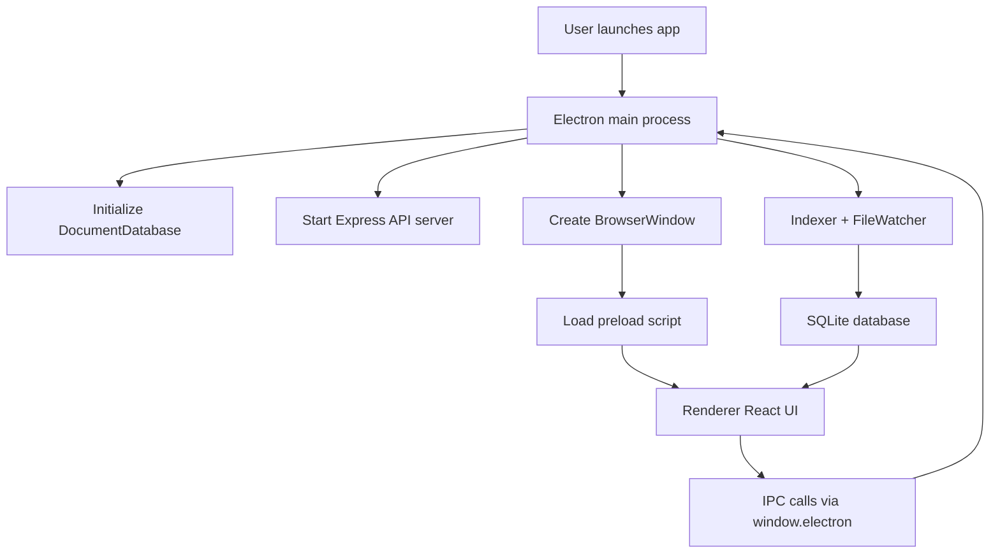
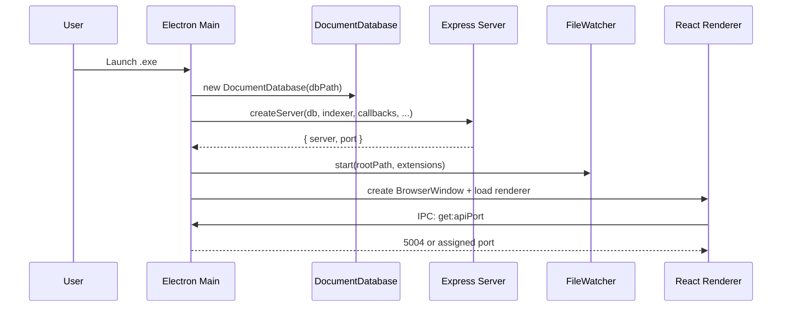
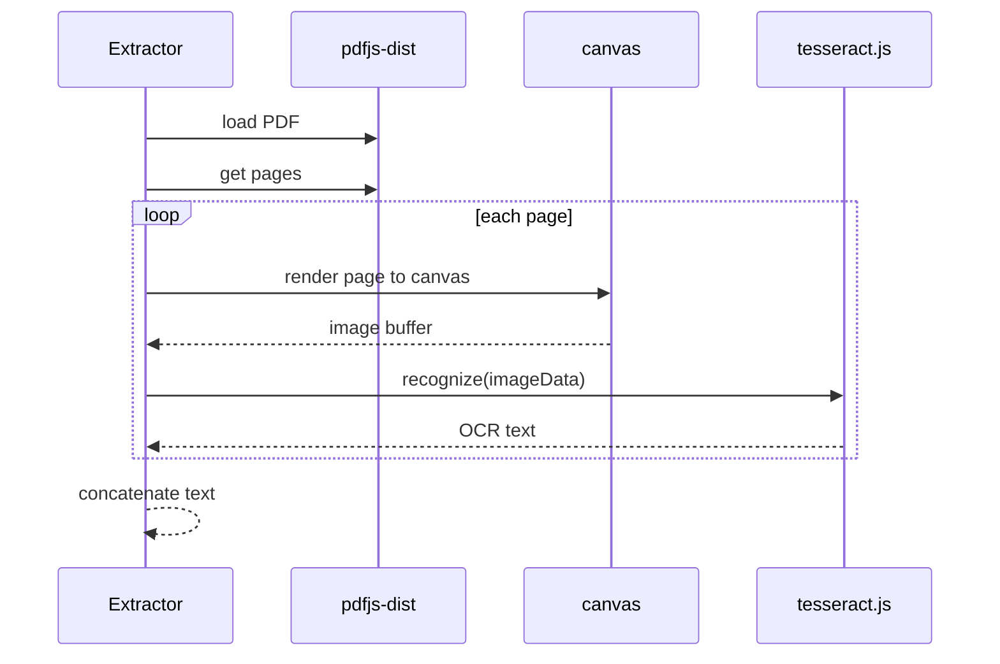
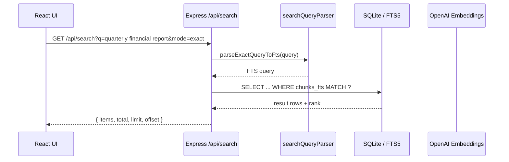
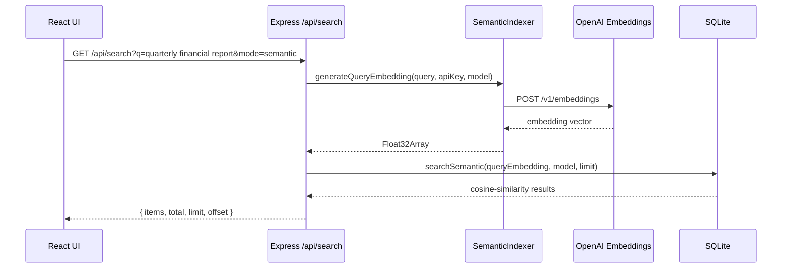

# DocumentFinder Architecture & Logic Deep Dive

This document is a code-level forensic walkthrough of the actual DocumentFinder implementation in this workspace. It traces the end-to-end execution path from application launch to search result rendering, and it documents the data structures, IPC channels, SQL schema, concurrency model, and error-handling patterns that are currently implemented.

## 1. Executive Summary

DocumentFinder is an Electron desktop application that combines:

- a React renderer UI,
- a Node.js/Electron main process,
- an Express-based local API server,
- a SQLite-backed index/store,
- and a document indexing pipeline that supports full-text search plus optional semantic search via OpenAI embeddings.

The architecture is pragmatic and relatively straightforward:

- The Electron main process owns the application lifecycle, database connection, watcher setup, and indexing orchestration.
- The renderer process is a React UI that talks to the main process through a secure preload bridge.
- The main process also runs a local Express API server that is the boundary between UI requests and indexing/storage logic.
- The indexing pipeline is implemented in the workspace package [node_modules/@document-finder/indexer](node_modules/@document-finder/indexer), and the database layer is implemented in [node_modules/@document-finder/db](node_modules/@document-finder/db).

The most important architectural insight is that the app is not using a separate worker process model. It relies on async/await and Promise-based orchestration in the main thread, with the semantic indexing path using concurrent in-process requests and batched DB writes.

---

## 2. Runtime Topology

### High-level flow



### Code locations

- Main process entry: [dist/main/index.js](dist/main/index.js)
- Preload bridge: [dist/preload/index.js](dist/preload/index.js)
- Renderer bundle: [dist/renderer](dist/renderer)
- Express server: [dist/main/server.js](dist/main/server.js)
- Indexer: [node_modules/@document-finder/indexer/src/indexer.ts](node_modules/@document-finder/indexer/src/indexer.ts)
- DB layer: [node_modules/@document-finder/db/src/database.ts](node_modules/@document-finder/db/src/database.ts)

---

## 3. Application Lifecycle: From Launch to First Search Result

### 3.1 Startup path

When the Electron app starts, the runtime path is:

1. Electron loads [dist/main/index.js](dist/main/index.js).
2. The module imports:
   - Electron APIs such as app, BrowserWindow, dialog, ipcMain, shell, Menu
   - the database layer from [node_modules/@document-finder/db/src/database.ts](node_modules/@document-finder/db/src/database.ts)
   - the indexer from [node_modules/@document-finder/indexer/src/indexer.ts](node_modules/@document-finder/indexer/src/indexer.ts)
   - the watcher from [node_modules/@document-finder/indexer/src/watcher.ts](node_modules/@document-finder/indexer/src/watcher.ts)
   - the server factory from [dist/main/server.js](dist/main/server.js)
3. The app registers early cleanup handlers for SIGINT/SIGTERM.
4. The app waits for Electron readiness via `app.whenReady()`.
5. The main process initializes the database at a platform-specific path via `getDbPath()`.
6. The main process creates a local Express API server via `createServer(...)`.
7. If a configured root folder exists, it starts the file watcher.
8. It creates the BrowserWindow.
9. It loads the renderer UI from either:
   - the Vite dev server if `VITE_DEV_SERVER_URL` is set, or
   - the built renderer assets in [dist/renderer/index.html](dist/renderer/index.html).
10. It initializes the updater and app menu.

### 3.2 Initialization sequence



### 3.3 What happens in main process at startup

The main process in [dist/main/index.js](dist/main/index.js) performs the following initialization steps:

- sets up the database path:
  - test mode uses a temp path
  - production uses `app.getPath('userData')/documents.db`
- creates a `DocumentDatabase` instance
- creates an `Indexer` instance
- creates an Express API server using `createServer(...)`
- starts a `FileWatcher` if the configured root path exists
- creates the main window and loads the renderer HTML
- registers IPC handlers for dialogs, shell actions, updates, and support state

### 3.4 Renderer bootstrapping

The renderer is loaded into the Electron BrowserWindow. The preload script in [dist/preload/index.js](dist/preload/index.js) exposes a `window.electron` object with safe IPC methods. The renderer then uses that object to call into the main process.

---

## 4. The IPC Bridge: Preload to Main Process

### 4.1 Preload contract

The preload script exposes the following API surface under `window.electron`:

| IPC channel | Direction | Purpose | Payload / return value |
|---|---|---|---|
| `dialog:selectFolder` | renderer -> main | choose a root folder | returns string or null |
| `dialog:selectSubfolder` | renderer -> main | choose a subfolder | returns string or null |
| `get:apiPort` | renderer -> main | discover local API port | returns number |
| `get:licensingApiUrl` | renderer -> main | get licensing endpoint | returns string |
| `get:appVersion` | renderer -> main | get app version | returns string |
| `get:platform` | renderer -> main | get platform label | returns `WINDOWS`, `MAC`, or `LINUX` |
| `get:defaultFolders` | renderer -> main | get Documents/Downloads/Desktop paths | returns object |
| `app:quit` | renderer -> main | quit application | returns void |
| `shell:openExternal` | renderer -> main | open external URL | expects string URL |
| `update:check` | renderer -> main | trigger update check | returns void |
| `update:download` | renderer -> main | download update | returns void |
| `update:install` | renderer -> main | install update | returns void |
| `support:get_state` | renderer -> main | get support prompt state | returns state |
| `support:snooze` | renderer -> main | snooze support prompt | returns void |
| `support:disable` | renderer -> main | disable support prompt | returns void |
| `support:record_contribute_clicked` | renderer -> main | log contribution click | returns void |

### 4.2 Main-process handlers

The corresponding handlers are registered in [dist/main/index.js](dist/main/index.js):

- `ipcMain.handle('get:apiPort', ...)`
- `ipcMain.handle('get:licensingApiUrl', ...)`
- `ipcMain.handle('get:appVersion', ...)`
- `ipcMain.handle('get:platform', ...)`
- `ipcMain.handle('get:defaultFolders', ...)`
- `ipcMain.handle('app:quit', ...)`
- `ipcMain.handle('dialog:selectFolder', ...)`
- `ipcMain.handle('dialog:selectSubfolder', ...)`
- `ipcMain.handle('shell:openExternal', ...)`
- `ipcMain.handle('update:check', ...)`
- `ipcMain.handle('update:download', ...)`
- `ipcMain.handle('update:install', ...)`
- `ipcMain.handle('support:get_state', ...)`
- `ipcMain.handle('support:snooze', ...)`
- `ipcMain.handle('support:disable', ...)`
- `ipcMain.handle('support:record_contribute_clicked', ...)`

### 4.3 Security model

The preload bridge is intentionally narrow. The app uses:

- `contextIsolation: true`
- `nodeIntegration: false`
- `sandbox: true`

That means the renderer cannot directly access Node.js or Electron internals; it must go through the bridge.

---

## 5. The Indexing Pipeline: From File Change to SQLite Row

### 5.1 Entry point for indexing

There are two ways a document gets indexed:

1. A file-system change event from the watcher triggers a re-index of that path.
2. A rebuild endpoint triggers a bulk re-index of the configured root folder.

The flow for a single file is implemented in [node_modules/@document-finder/indexer/src/indexer.ts](node_modules/@document-finder/indexer/src/indexer.ts).

### 5.2 New-document lifecycle example: a 10MB PDF

For a new PDF file, the lifecycle is:

1. The watcher sees the file.
2. The main process callback calls `indexer.indexFile(filePath, false)`.
3. The indexer calls `fs.stat(filePath)`.
4. It checks the existing document entry in SQLite by path.
5. If the file is unchanged (same `mtimeMs` and `sizeBytes`), indexing is skipped.
6. Otherwise, the pipeline continues.
7. It calls `extractTextFromFile(filePath)`.
8. It detects language using `detectLanguage(extracted.text)`.
9. It upserts a document row with metadata.
10. It deletes old chunks for that document.
11. It normalizes and chunks the extracted text.
12. It inserts the chunk rows and FTS entries.
13. It updates the document’s last-indexed timestamp.

### Pseudo-code

```ts
async indexFile(filePath, force = false) {
  const stats = await fs.stat(filePath);
  if (!force && existingDocSameMetadata(stats)) return;

  const extracted = await extractTextFromFile(filePath);
  const language = await detectLanguage(extracted.text);

  const docId = db.upsertDocument({ path, name, ext, mtimeMs, sizeBytes, detectedLanguage: language, hasOcr: extracted.hasOcr });
  db.deleteChunksForDocument(docId);

  const chunks = chunkText(extracted.text);
  const dbChunks = chunks.map(...);
  db.insertChunks(dbChunks);
  db.updateDocumentIndexedTime(docId);
}
```

### 5.3 Watcher behavior and event coalescing

The watcher is implemented in [node_modules/@document-finder/indexer/src/watcher.ts](node_modules/@document-finder/indexer/src/watcher.ts).

It uses `chokidar.watch(...)` with:

- `ignored: /(^|[\/\\])\../` to ignore dotfiles
- `persistent: true`
- `ignoreInitial: true`

Event handling is debounced:

- each event is stored into `pendingEvents` keyed by file path
- a timer is reset on each new event
- after the debounce period (`debounceMs`, default `1000`) the pending events are flushed and the callback is called once per path

This means the watcher does not create a true queue. It uses a coalescing map and a timer to collapse bursts of add/change/delete events into a smaller set of operations.

### Important implementation detail

The main process callback wiring in [dist/main/index.js](dist/main/index.js) does this:

- on `delete` it calls `indexer.deleteFile(event.path)`
- on `add`/`change` it calls `indexer.indexFile(event.path)`

There is no explicit queue, retry queue, or worker pool. The file-system changes are processed serially in the current event loop.

---

## 6. Parser Selection: How the Extractor Chooses a Parser

The parser dispatch is implemented in [node_modules/@document-finder/indexer/src/extractors.ts](node_modules/@document-finder/indexer/src/extractors.ts).

### Current logic

```ts
const ext = path.extname(filePath).toLowerCase().slice(1);

switch (ext) {
  case 'txt':
  case 'md': return extractFromTxt(filePath);
  case 'docx': return extractFromDocx(filePath);
  case 'pdf': return extractFromPdf(filePath);
  default: throw new Error(`Unsupported file type: ${ext}`);
}
```

### What this means

- The logic is extension-based only.
- It does not inspect magic bytes or MIME type.
- A `.pdf` file is treated as PDF regardless of whether it is actually a real PDF object.
- A `.txt` or `.md` file is read as plain text.
- A `.docx` file is parsed with mammoth.

### Supported formats in current code

- `.txt`
- `.md`
- `.docx`
- `.pdf`

The upload endpoint in [dist/main/server.js](dist/main/server.js) also explicitly documents that the app supports `.txt`, `.md`, `.pdf`, and `.docx` for search.

---

## 7. PDF Extraction and OCR Fallback

### 7.1 Normal PDF extraction

For PDFs, the extractor:

- reads the file into a Buffer,
- loads `pdfjs-dist` using a compatibility import path,
- converts the Buffer to a `Uint8Array` because of `pdfjs-dist` compatibility expectations,
- opens the PDF with `getDocument({ data: uint8Array, disableWorker: true })`,
- iterates over pages,
- calls `page.getTextContent()` for every page,
- joins the text items into a page-level string while preserving line breaks when `item.hasEOL` is present.

### 7.2 OCR trigger heuristic

After running text extraction across all pages, the code calculates:

```ts
const avgCharsPerPage = extractedText.length / numPages;
if (avgCharsPerPage < 10) {
  return await extractFromPdfWithOcr(filePath);
}
```

This is a simple heuristic:

- if the extracted text is very sparse, the PDF is assumed to be scanned or image-based,
- OCR is then attempted.

### 7.3 OCR implementation

The OCR path in [node_modules/@document-finder/indexer/src/extractors.ts](node_modules/@document-finder/indexer/src/extractors.ts) does the following:

1. Creates a Tesseract worker with the language string `eng+spa+fin+swe`.
2. Loads the PDF again with `pdfjs-dist`.
3. Tries to import `canvas`.
4. If `canvas` is unavailable, it logs a warning and returns an empty OCR result.
5. If `canvas` is available:
   - renders each PDF page into a canvas using `page.render({ canvasContext, viewport }).promise`,
   - converts the canvas to a PNG data URL with `canvas.toDataURL('image/png')`,
   - sends it to Tesseract using `worker.recognize(imageData)`,
   - appends the recognized text.
6. Terminates the worker in a `finally` block.

### OCR sequence



### Important caveat

OCR is not a full image-to-text pipeline with layout analysis; it is a very direct page-by-page render-to-image → OCR flow.

---

## 8. Text Normalization and Chunking

### 8.1 Sanitization logic

The normalization function is implemented in [node_modules/@document-finder/indexer/src/normalizer.ts](node_modules/@document-finder/indexer/src/normalizer.ts).

It applies these transformations in order:

1. Unicode normalization via `text.normalize('NFKC')`
2. Removal of zero-width characters using:
   ```ts
   normalized = normalized.replace(/[\u200B-\u200D\uFEFF]/g, '');
   ```
3. Removal of soft hyphens using:
   ```ts
   normalized = normalized.replace(/\u00AD/g, '');
   ```
4. Preservation of ALLCAPS compounds via a regex that keeps hyphenated compounds such as `SES-kurssi`.
5. Dehyphenation of line-break artifacts, for example:
   - `word-\nnext` becomes `wordnext`
   - `word- next` becomes `wordnext`
6. Collapse multiple whitespace runs using:
   ```ts
   normalized = normalized.replace(/[ \t]+/g, ' ');
   ```
7. Collapse repeated newlines using:
   ```ts
   normalized = normalized.replace(/\n\s*\n+/g, '\n');
   ```
8. Trim whitespace at the edges.

### 8.2 Regexes used explicitly

The file uses these exact patterns:

- Zero-width character removal:
  ```ts
  /[\u200B-\u200D\uFEFF]/g
  ```
- Soft-hyphen removal:
  ```ts
  /\u00AD/g
  ```
- ALLCAPS compound preservation:
  ```ts
  new RegExp(`([\\p{Lu}\\p{M}]{2,})[${hyphenChars}]\\s*[\\r\\n]+\\s*(${letterPattern}+)`, 'gu')
  ```
- Dehyphenation of lowercase continuation words:
  ```ts
  new RegExp(`(${letterPattern}+)[${hyphenChars}]\\s*[\\r\\n]+\\s*([\\p{Ll}\\p{M}]${letterPattern}*)`, 'gu')
  ```

### 8.3 Chunking behavior

The chunking function is `chunkText(text, chunkSize = 1000, overlap = 100)`.

It:

- normalizes the text first,
- slices the text into chunks of roughly 1000 characters,
- attempts to break at a word boundary when possible,
- uses an overlap of 100 characters between chunks,
- keeps the original text slice for `textOriginal` and the normalized slice for `textNormalized`.

### Why this matters

The semantic indexer does not generate chunks independently. It consumes the already-created chunks from the normalizer. That means the semantic embedding granularity is controlled by the chunking logic.

---

## 9. Semantic Indexing: Embedding Pipeline

### 9.1 Entry point

Semantic indexing is implemented in [node_modules/@document-finder/indexer/src/semantic-indexer.ts](node_modules/@document-finder/indexer/src/semantic-indexer.ts).

The route that triggers it is [dist/main/server.js](dist/main/server.js):

- `POST /api/semantic/rebuild`

### 9.2 What it does

For each chunk that lacks an embedding for the configured model, it:

1. reads the chunk text from SQLite,
2. calls OpenAI embeddings,
3. stores the resulting vector as a BLOB in `chunk_embeddings`.

### 9.3 Exact embedding request payload

The request is made with `fetch('https://api.openai.com/v1/embeddings', {...})`.

The request body is:

```json
{
  "input": "<chunk text>",
  "model": "<configured model>"
}
```

The exact headers are:

```ts
headers: {
  'Content-Type': 'application/json',
  'Authorization': `Bearer ${apiKey}`
}
```

The default model is:

```ts
config.openaiEmbeddingModel || 'text-embedding-3-small'
```

The app also supports `'text-embedding-3-large'` via the `Config` type in [node_modules/@document-finder/core/src/index.ts](node_modules/@document-finder/core/src/index.ts).

### 9.4 Concurrency and retry behavior

The semantic indexer does not use `worker_threads` or `child_process`. It uses:

- `Promise.all(...)` over a pool of concurrent workers,
- `maxConcurrency` defaulting to `2`,
- `batchSize` defaulting to `100`,
- adaptive backoff on rate limiting,
- a circuit breaker for repeated rate limits,
- retries on transient errors.

### 9.5 Why this matters

This is the app’s “AI engine,” but it is not a local model. It is a remote embedding pipeline using the OpenAI API.

---

## 10. Search Execution Path

### 10.1 User typing a query

Suppose the user types `quarterly financial report` and presses Enter.

The flow is:

1. The renderer sends a request to the local Express API.
2. The Express server receives the request on `GET /api/search`.
3. The server parses query params: `q`, `limit`, `offset`, `mode`, `one_per_document`.
4. If `mode === 'semantic'`, the server generates a query embedding and uses vector similarity.
5. Otherwise, the server constructs an FTS query and runs SQLite FTS5 with `MATCH ?`.
6. The server returns JSON to the renderer.
7. The renderer renders the result list and snippets.

### 10.2 Exact route and signature

The route is defined in [dist/main/server.js](dist/main/server.js):

```ts
app.get('/api/search', async (req, res) => { ... })
```

The request parameters are:

- `q` - required search string
- `limit` - default `50`
- `offset` - default `0`
- `mode` - default `'exact'`
- `one_per_document` - optional boolean for deduplication

### 10.3 FTS path

The server normalizes the query and builds an FTS query using [dist/main/searchQueryParser.js](dist/main/searchQueryParser.js):

```ts
const normalizedQuery = normalizeText(query);
const searchQuery = normalizedQuery.replace(/\s+/g, ' ').trim();
const ftsQuery = parseExactQueryToFts(searchQuery);
```

The parser does this:

- if there are no boolean operators, it returns a single quoted term or phrase,
- if there are `AND` or `OR` operators, it splits the query and joins the terms with boolean operators.

Example translation:

```text
quarterly financial report
=> "quarterly financial report"
```

and:

```text
quarterly AND report
=> quarterly AND report
```

### 10.4 FTS stop-word behavior

There is no custom stop-word removal step in the code.

That means:

- the app does not maintain an explicit stop-word list,
- the query parser does not remove common words such as `the`, `and`, or `of`,
- FTS5 tokenization is controlled by SQLite’s `unicode61` tokenizer.

So the search engine is effectively keyword/phrase based, not a classic BM25 system with stop-word filtering.

### 10.5 Semantic search path

If `mode === 'semantic'`, the server does the following:

1. checks if an OpenAI API key is configured,
2. builds a model string (`config.openaiEmbeddingModel || 'text-embedding-3-small'`),
3. calls `new SemanticIndexer(db).generateQueryEmbedding(query, apiKey, model)`,
4. calls `db.searchSemantic(queryEmbedding, model, limit)`.

### 10.6 Relevance scoring

The exact search path uses SQLite FTS5 ranking (`row.rank`).

The semantic path uses cosine similarity over the stored embedding vectors.

The current code does not blend FTS5 and semantic results in a hybrid ranking stage. Instead:

- exact mode returns FTS results,
- semantic mode returns semantic similarity results,
- there is no combined score or fusion strategy in the current implementation.

### 10.7 Search sequence diagram



And for semantic mode:



---

## 11. Database Schema and State Model

### 11.1 Database file location

The database path is determined in [dist/main/index.js](dist/main/index.js):

- test mode uses a temp directory,
- production uses Electron’s `userData` folder.

The file name is `documents.db`.

### 11.2 Core schema

The schema is created in [node_modules/@document-finder/db/src/migrations.ts](node_modules/@document-finder/db/src/migrations.ts).

#### Table: documents

| Column | Type | Constraints | Meaning |
|---|---|---|---|
| id | INTEGER | PRIMARY KEY AUTOINCREMENT | document row id |
| path | TEXT | NOT NULL UNIQUE | absolute file path |
| name | TEXT | NOT NULL | file basename without extension |
| ext | TEXT | NOT NULL | extension |
| mtime_ms | INTEGER | NOT NULL | last modification time |
| size_bytes | INTEGER | NOT NULL | file size |
| sha256 | TEXT | NULL | hash (if present) |
| detected_language | TEXT | NULL | detected language |
| last_indexed_at | INTEGER | NULL | timestamp |
| has_ocr | INTEGER | NOT NULL DEFAULT 0 | whether OCR was used |

#### Table: chunks

| Column | Type | Constraints | Meaning |
|---|---|---|---|
| id | INTEGER | PRIMARY KEY AUTOINCREMENT | chunk id |
| document_id | INTEGER | NOT NULL | FK to documents.id |
| chunk_index | INTEGER | NOT NULL | chunk position |
| start_offset | INTEGER | NOT NULL | original text offset start |
| end_offset | INTEGER | NOT NULL | original text offset end |
| text_original | TEXT | NULL | original chunk text |
| text_normalized | TEXT | NOT NULL | normalized chunk text |

#### Table: chunks_fts

| Column | Type | Constraints | Meaning |
|---|---|---|---|
| chunk_id | INTEGER | UNINDEXED | references chunk id |
| text_normalized | TEXT | | FTS-indexed text |

This is created as a virtual FTS5 table:

```sql
CREATE VIRTUAL TABLE IF NOT EXISTS chunks_fts USING fts5(
  chunk_id UNINDEXED,
  text_normalized,
  tokenize = 'unicode61'
);
```

#### Table: chunk_embeddings

| Column | Type | Constraints | Meaning |
|---|---|---|---|
| chunk_id | INTEGER | NOT NULL | FK to chunks.id |
| embedding_model | TEXT | NOT NULL DEFAULT 'text-embedding-3-small' | model used |
| embedding | BLOB | NOT NULL | serialized Float32Array bytes |
| embedded_at | INTEGER | NOT NULL | timestamp |

Primary key is `(chunk_id, embedding_model)`.

### 11.3 Indexes

The migration creates these indexes:

```sql
CREATE INDEX IF NOT EXISTS idx_documents_path ON documents(path);
CREATE INDEX IF NOT EXISTS idx_chunks_document_id ON chunks(document_id);
CREATE INDEX IF NOT EXISTS idx_chunks_chunk_index ON chunks(document_id, chunk_index);
CREATE INDEX IF NOT EXISTS idx_chunk_embeddings_model ON chunk_embeddings(embedding_model);
```

### 11.4 Schema metadata

The app also creates a `schema_meta` table and sets `user_version = 1`.

---

## 12. Incremental Updates and Data Lifecycle

### 12.1 Update detection logic

The indexer uses the document’s stored metadata to decide whether to re-index:

```ts
if (existing && existing.mtimeMs === stats.mtimeMs && existing.sizeBytes === stats.size) {
  return;
}
```

That means a file is considered unchanged if:

- the mtime matches, and
- the size matches.

### 12.2 What happens on change

On change, the flow is:

1. `db.upsertDocument(...)`
2. `db.deleteChunksForDocument(documentId)`
3. re-insert chunk rows and FTS rows
4. update indexed timestamp

### 12.3 Deletion handling

For deleted files, the app calls `db.deleteDocument(path)` which deletes the document rows and corresponding chunks.

### 12.4 Important data-consistency finding

The implementation of [node_modules/@document-finder/db/src/database.ts](node_modules/@document-finder/db/src/database.ts) deletes embeddings and chunks, but it does not explicitly delete rows from `chunks_fts` in `deleteChunksForDocument(...)`.

The method currently does:

```ts
this.db.prepare('DELETE FROM chunk_embeddings WHERE chunk_id IN (...)').run(...);
this.db.prepare('DELETE FROM chunks WHERE document_id = ?').run(documentId);
```

There is no explicit `DELETE FROM chunks_fts` in that method.

This is a meaningful implementation detail. It suggests that FTS rows may become stale when chunks are replaced or deleted unless some other cleanup path runs. The full clear path does delete from `chunks_fts` explicitly, so the obvious risk is that incremental updates may leave FTS data inconsistent.

This is one of the most important forensic findings in the codebase.

---

## 13. Concurrency and Performance Model

### 13.1 Explicit concurrency model

The current implementation does not use:

- `worker_threads`
- `child_process`
- a background worker pool
- a true queue worker service

The indexing and semantic indexing pipelines are mostly in-process and asynchronous.

### 13.2 What is used instead

The code uses:

- `async/await`
- `Promise.all(...)` for semantic indexing batches
- `setTimeout(...)` for debounce and retry backoff
- `fs`/`pdfjs-dist`/`tesseract.js` operations that yield through promises

### 13.3 Why the UI stays responsive

The main process is not blocked by the file watcher or by the HTTP server because the app uses async I/O and awaits most work. That is sufficient to prevent total UI freeze for many workloads.

However, the app is still single-threaded in the main process. That means:

- heavy OCR work can still be CPU-intensive,
- large PDF parsing can still compete with the event loop,
- the UI can still feel sluggish if the main process becomes busy with indexing and semantic work.

### 13.4 Auto-pause logic

The auto-pause logic is implemented in [dist/main/indexingAutoPause.js](dist/main/indexingAutoPause.js).

It checks:

- whether the machine is on battery power,
- whether the CPU load exceeds a configured threshold.

The logic is:

```ts
if (config.pauseIndexingOnBattery && isOnBatteryPower) -> shouldPause
if (config.pauseIndexingOnHighCpu && cpuUsagePercent >= threshold) -> shouldPause
```

The CPU usage is estimated from `os.loadavg()[0]` divided across CPU cores:

```ts
const oneMinuteLoad = os.loadavg()[0] || 0;
return Math.min(100, Math.round((oneMinuteLoad / cores) * 100));
```

### What this does not do

It does not use:

- disk I/O throttling,
- idle detection,
- OS-level scheduling hints,
- process priority adjustment,
- worker thread offloading.

It is a lightweight CPU/battery pause mechanism, not a full performance governor.

---

## 14. Error Handling Patterns

### 14.1 Main-process error handling

The app uses a mixture of:

- `try/catch` around async operations,
- `console.error(...)` logging,
- `res.status(500).json({ error })` in the Express API,
- IPC event emission for UI progress/error updates.

### 14.2 Indexer error handling

On file indexing error, the indexer catches errors and calls the callback with a structured object:

```ts
{ path: filePath, error: errorMsg }
```

### 14.3 Semantic indexer error handling

The semantic indexer handles:

- invalid API key errors,
- rate limiting,
- service errors,
- retries,
- circuit breaker pauses,
- network errors,
- timeouts.

### 14.4 Express error middleware

The server registers a global error middleware:

```ts
app.use((err, req, res, next) => {
  console.error('[Server] Unhandled error:', err);
  res.status(500).json({ error: err instanceof Error ? err.message : String(err) });
});
```

This ensures unhandled errors surface as HTTP 500 responses.

---

## 15. Rebuild Strategy and Architectural Bottlenecks

### 15.1 Current rebuild strategies

The app supports two rebuild modes:

- incremental sync via `indexer.sync(...)`
- full rebuild via `indexer.rebuildFull(...)`

The server routes are:

- `POST /api/index/rebuild`
- `POST /api/index/rebuild-full`

### 15.2 The three biggest bottlenecks

#### 1. Full re-indexing is fully serial

The indexer walks the file tree and processes files one-by-one. There is no parallel file processing, no worker pool, and no batched directory scan worker.

Impact:

- large folders are slow,
- the main thread does all the work,
- the app feels less responsive during large rebuilds.

#### 2. Semantic indexing is rate-limit and API-bound

Semantic embedding generation is bound by OpenAI API latency and rate limits. The current implementation uses a small concurrency limit and adaptive backoff, but it is still effectively a remote network bottleneck.

Impact:

- semantic indexing can take a very long time,
- the app can stall or back off repeatedly,
- network errors and token budget become dominant.

#### 3. The database write path is not optimized for very large indexes

Each document chunk is inserted and then FTS rows are inserted in the same transaction path, but the overall process is still a write-heavy synchronous loop.

Impact:

- indexing large corpora can cause write amplification,
- there is no bulk import pipeline or optimized chunk buffer,
- the app is likely to slow significantly for very large folders.

### 15.3 Biggest single point of failure

The biggest single point of failure is the main-process orchestration model combined with the stateful database/FTS update path.

Concretely:

- all indexing work is orchestrated in the main process,
- the database is updated directly in-process,
- the app does not isolate indexing into worker processes,
- the FTS/embedding consistency is sensitive to partial failures.

The most concerning implementation-level risk is the FTS inconsistency risk discussed above: chunk deletion/replacement may leave orphaned FTS entries because the current delete code does not explicitly clear `chunks_fts` rows.

---

## 16. What Must Stay the Same if Rewritten in Rust/Tauri or Modern Next.js/Electron

If this app were rewritten from scratch in Rust/Tauri or a modern Next.js/Electron stack, the core logic should remain the same:

### Must remain the same

1. The document ingestion model
   - detect files,
   - extract text,
   - normalize text,
   - chunk it,
   - index it.

2. The two search modes
   - exact/keyword search via an inverted index or FTS engine,
   - semantic search via embeddings and vector similarity.

3. The concept of persistence
   - store metadata, chunks, and embeddings locally,
   - keep re-indexing incremental and deterministic.

4. The local-first architecture
   - the app should still work offline for existing indexes,
   - semantic search may require network access.

### Can be improved dramatically

1. Move indexing to background workers
   - use a true worker pool or separate process model,
   - avoid doing heavy CPU work in the UI/main thread.

2. Replace the current simplistic extension-based parser dispatch
   - use MIME sniffing/magic-byte detection,
   - improve PDF/Office parsing resilience.

3. Use a more robust hybrid search pipeline
   - combine FTS and vector results explicitly,
   - implement a real hybrid ranking function.

4. Make the database layer transactional and more explicit
   - delete FTS rows alongside chunk rows,
   - use stronger consistency checks,
   - add migration validation and integrity assertions.

5. Introduce background indexing queueing and resumability
   - allow pause/resume,
   - allow retries,
   - allow durable state and progress snapshots.

---

## 17. Bottom Line

DocumentFinder’s current implementation is a solid, practical local document search tool with a clear separation of concerns:

- Electron app shell,
- Express API boundary,
- SQLite local index,
- chunk-based text indexing,
- optional semantic search via OpenAI embeddings.

Its biggest strengths are:

- straightforward architecture,
- clear separation between indexing and search,
- incremental update support,
- local-first storage,
- optional semantic search.

Its biggest weaknesses are:

- no true worker-based indexing pipeline,
- no hybrid FTS + semantic ranking,
- potential FTS inconsistency on chunk replacement/deletion,
- simple parser dispatch and OCR heuristic.

That combination makes it a good prototype and a good foundation for a more scalable search platform, but it is not yet a high-performance distributed indexing engine.
